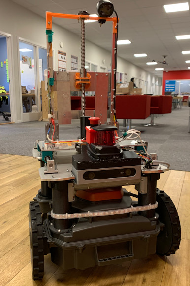
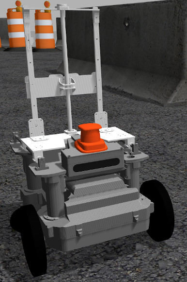

# UNICORN




This repository contains the main ROS packages for the 2020th iteration of UNICORN, the trash-collecting robot.

This project was made for ROS Kinetic.

* [ROS Kinetic](http://wiki.ros.org/kinetic/Installation/Ubuntu) - ROS Kinetic installation instructions for Ubuntu 16.04.

* [ROS Tutorials](http://wiki.ros.org/ROS/Tutorials/InstallingandConfiguringROSEnvironment) - Guide for setting up your ROS workspace. 

## Getting Started

Please read through the coding style guides we are using

* [CppStyleGuide](http://wiki.ros.org/CppStyleGuide) - ROS Cpp Style Guide
* [PyStyleGuide](http://wiki.ros.org/PyStyleGuide) - ROS Python Style Guide

* [LabVIEW implementations](https://github.com/NihadF7/UNICORN-2020-LabVIEW) - Repository containing the LabVIEW implementations for the robots sensors etc.

### Dependencies

Make sure you have cloned the repository into the src folder of your workspace (the following instructions assumes that it is called catkin_ws).

```
cd ~/catkin_ws/src
git clone https://github.com/HusqvarnaResearch/hrp.git
git clone https://github.com/husky/husky.git
```

Goto hrp/am_driver_safe and insert a CATKIN_IGNORE file.
```
cd hrp/am_driver_safe
touch CATKIN_IGNORE
```

Install dependencies with rosdep
```
cd ~/catkin_ws
rosdep install --from-path src --ignore-src -r -y
```

The above dependencies should be enough to get the simulator working.

### Dependencies for the robot
* [ZED Camera SDK](https://www.stereolabs.com/developers/release/) - Install the SDK for JETPACK 3.3 on the TX2 platform if needed

*TODO: Add realsense camera instructions*

*TODO: Probably add even more instructions*

### Run the Simulator

The simulator can be started using the simulator_2020.launch file in the main unicorn package.

```
roslaunch unicorn simulator_2020.launch
```

Launching without any additional arguments will start SLAM by default, but can be turned off with the do_slam argument. 

```
roslaunch unicorn simulator_2020.launch do_slam:=false
```

The gazebo client is not started by default, and needs to be stared manually.

```
gzclient
```

A rviz configuration including all sensors is included in the unicorn package, and can be launched using the rviz.launch file.

```
roslaunch unicorn rviz.launch
```

## Documentation

Generate documentation using rosdoc_lite by running:
> ./generate_doc.sh

Then access the documentation by running:
> xdg-open docs/doc/unicorn/html/annotated.html
> xdg-open docs/doc/local_planner/html/annotated.html

Or by going to the html folder and double-clicking on annotated.html.

Please refer to docs/QuickStart.md for help on how to launch the platform.

## How to Git

Please refer to this cheat sheet before doing anything.

* [GitCheatSheet](https://services.github.com/on-demand/downloads/github-git-cheat-sheet.pdf) - Git Cheat Sheet

Open a command window and run:

```
man git
```

To access the git manual.

#### Clone the repository

```
cd ~/catkin_ws/src
git clone https://github.com/willys0/UNICORN-2020.git
```

#### Checkout the branch you want and make a local one

```
git branch --list
git checkout <branch>
git branch <new-branch>
```

#### When your code is stable merge the branches

```
git checkout <branch>
git merge <local-branch>
```

If you are working on the same branch it's good practice to always run a fetch & pull when you start your workday.

```
git fetch
git pull
```

#### Push your changes remotely with a commit message

```
git add .
git commit -m "Commit message goes here"
git push origin <branch> 
```

