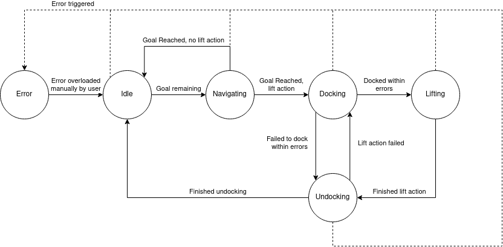

# unicorn_state_machine

State machine providing the high-level behaviour of the UNICORN robot. States and transitions are implementing for navigating between refuse bin stations with `move_base`, docking and undocking using the `unicorn_docking` controller, and activating the lift. A graph of the overall structure of the state machine can be seen below.

The state machine will iterate through a queue of goals that are defined by the user ahead of time (in a .yaml file) or during run-time (through the service API). User interactions are handled through a service-based interface, and services are provided for starting/pausing the state machine, stamping the current pose of the robot as a goal, as well as for forcing the error state.

Note that goal poses should be placed in such a way that the robot is positioned some distance away from the targeted refuse bin station, with the rear facing it (such that the attached AprilTag is in view of the rear camera).

## Nodes

`unicorn_state_machine_node` - Main node.

## Service API

`~/force_stop` - Boolean argument, will force the error state if true

`~/set_running` - Boolean argument, will set the state machine as running if true, or pause it upon transition to the next state.

`~/stamp_goal` - Integer argument, stamps the current position and orientation of the robot and adds it last in the goal queue. The provided argument decides which lift action to carry out once the goal pose is reached, where 0 is no action, 1 will perform pickup/loading, and 2 will perform dropoff/unloading. Docking will not be initiated if a 0 argument is provided, only when the lift is to be activated. 

## Subscribed topics

`/tf` - Used to lookup the transform between the the `/map` frame and the base frame of the robot when stamping a goal.

## Published topics

`~/current_state` - Identifier of the current active state, where the identifiers are mapped as follows: (0) Idle, (1) Navigating, (2) Docking, (3) Lifting, (4) Undocking, (6) Error.

`~/goal_poses` - Pose array of the current goals for visualization purposes

## Parameters

`~/autostart` - Boolean, whether to set the state machine as running automatically when the node is started.

`~/publish_poses` - Boolean, whether to publish current goals as a pose array for visualization purposes. 

`~/repeat` - Boolean, whether to run the list of goals again after all goals have been processed.

`~/robot_base_frame` - String, the tf frame for the base of the robot to be used when stamping a goal.
