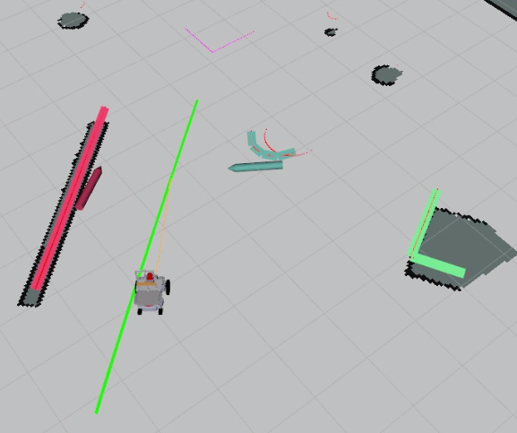

# UNICORN LIDAR TRACKING PACKAGE

    This package is a prototype that performs tracking with 2D Lidar data through shape extraction

    Lidar data is clustered with Adaptive Break-Point Detection and tracked using Kalman filters  

    The package is built and tested for the simulator, but it is not as refined for a real-world platform.

    

## Subscribed Topics

    /odometry/filtered - Used to relate the position of the robot to the map

    /scan - 2D Lidar scan 

    /wheel_encoder/odom - This is an odometry source which provides an estimated movement, this odometry should not contain any sharp moment that odometry based on global coordinates as GPS can supply. For example, an odometry source that uses AMCL would not work, however, wheel encoders which only measure the perceived movement by the motors currently provide the best source for this.

## Published Topics 

    obstacles - costmap_converter/ObstacleArrayMsg message with all detected dynamic obstacles, this type of array can be read by TEB for dymanic obstacle avoidance support. 

    markerArray - visualization_msgs/MarkerArray message which visualizes the obstacles in rviz.

    markerArrowArray - visualization_msgs/MarkerArray message which visualizes the direct with the obstacle is moving in rviz.

## Changeable Parameters 

    Parameters which can be adjusted with dynamic config through RQT:

### Clustering
    lambda: (defualt 0.05) - Calibration value for clusters used in adaptive break-point detection, the larger value will give finer clusters while smaller value allows for larger margins.
    max_dist_laser: (defualt 5.0)- Greatest distance allowed when detecting objects, this should not be set to a too high value.

### Static object filter -  removes objectles according to a predefined map
    static_filter: (defualt true) - Enables/Disables static object filter.
    Static_map_removal_tolerance: (defualt 4) - Tolerance of filter in cells on the occupancy grid.
    static_remove_ratio: (defualt 0.5) - Percentage of the cluster that needs to be considered as occupied for the cluster to be removed.
### Shape Extraction
    polygon_tolerance: (default 1.02) - Tolerance in per cent for shape extraction, lower tolerance will give finer shapes.
    polygon_side_min_points_required: (defualt 4) - Points required to contineu searching for a better shape in shape extraction.

### Association

    similarty_side_length_weight: (defualt 1.0) - Weight when comparing side lenght.
    similarty_side_angle_weigh: (defualt 1.0) - Weight for comparing angles between sides.
    similarty_side_amount_weight: (defualt 1.0) - Weight for comparing amount of sides.
    similarty_track_xposition_weight: (defualt 5.0) - Weight for comparing predicted x position to measured x position.
    similarty_track_yposition_weight: (defualt 5.0) - Weight for comparing predicted y position to measured y position.
    similarty_previous_position_weight: (defualt 2.0) - Weight for comparing previous position with current position.
    max_similarty_deviation: (defualt 2.0) - Maximum allowed value for deviation based on similarity index.
    min_size_cluster: (default 4) - Minimum points in the cluster to count it in the association step.

### Tracker

    min_twist_detection: (default 0.3) - The minimum estimated velocity that is needed the velocity to be shown in the visualisation.
    TRACKER_LIFE: (default 50) - Frames that a tracker will live before removed if no matching object is found.
    CONFIRMED_TRACK: (default 20) - Frames that an object should be tracked before that tracker is confirmed.

### Frames
    mapframeid: (defualt map)
    odomframeid: (defualt odom_chassis)
    base_laser_frame: (defualt base_laser)
    base_frame: (defualt base_link)